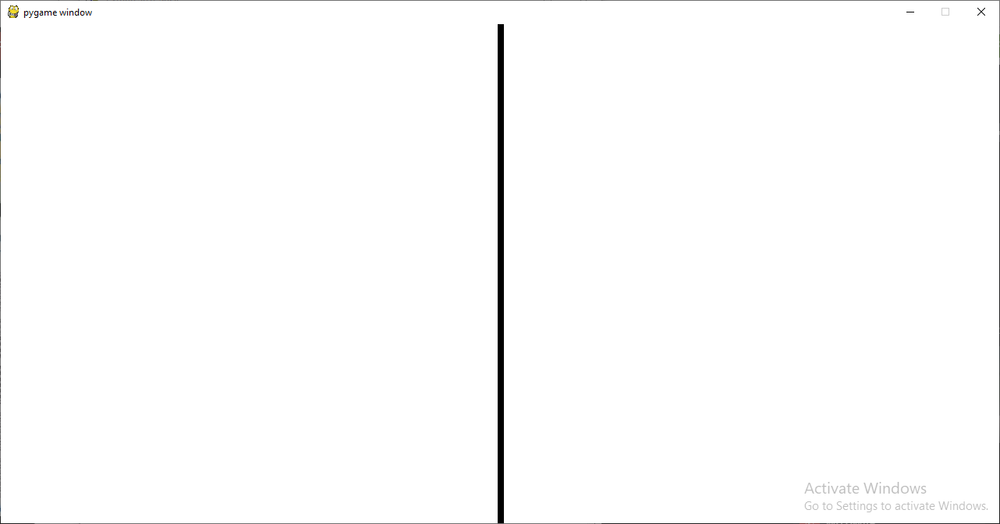
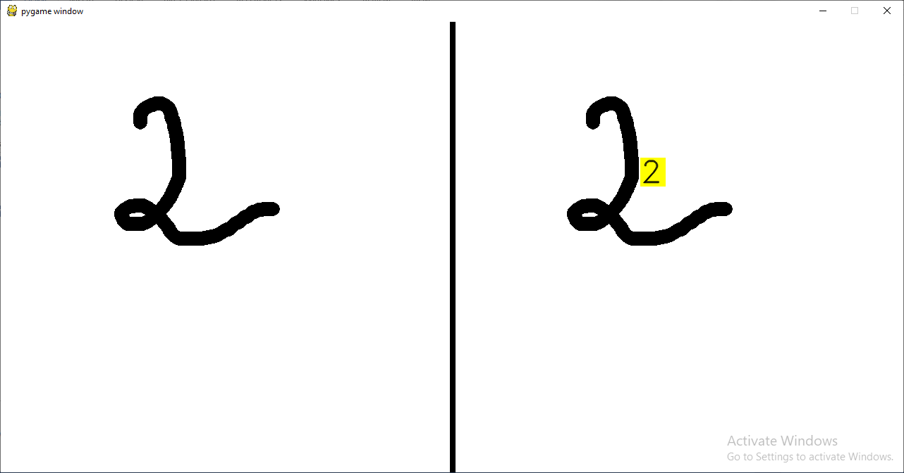
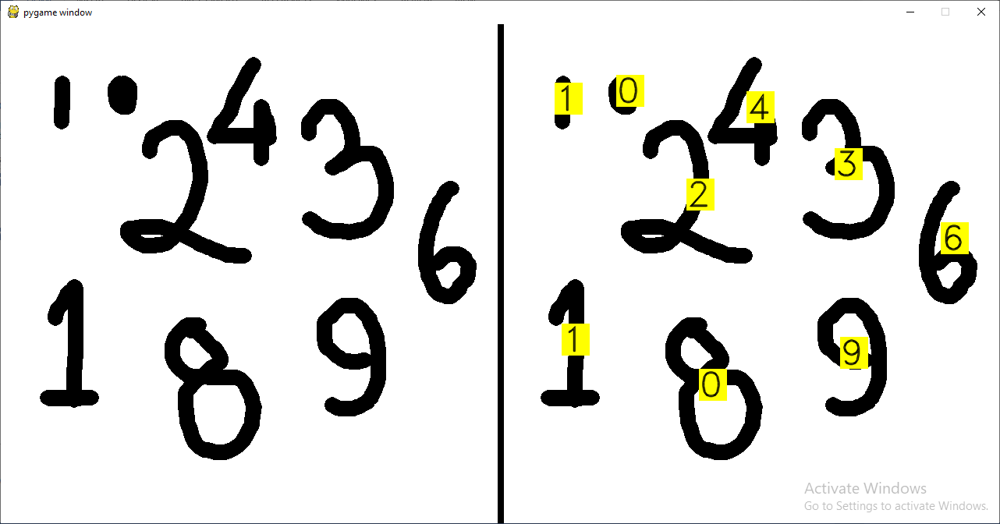

# Digit-Recogniser
An application that uses Convolutional Neural Networks to recognize handwritten digits.

Done in Python using Keras with Tensorflow Backend
Technologies used (python libraries used):
<ul><li>Pygame</li>
<li>Opencv</li>
<li>Pandas</li>
<li>Keras</li>
<li>Tensorflow/theano</li>
<li>Numpy</li>
<li>Matplotlib</li>
<li>Scipy</li>
</ul>

By clicking on the launchapp.py file, the pygame user interface gets opened which allows you to draw a number on the left half of the screen. Start drawing by the mouse left click and release the button when drawing is complete. Right-click to refresh the screen.

I have used Keras with Tensorflow backend to train my machine learning model. Model Specifications:

 <ol>
  <li>It is a sequential model.</li>
  <li>The neural network created by adding layers to this model is Convolutional Neural Network.</li>
  <li>The model training is done using the MNSIT dataset for digit classification provided in the Keras library.</li>
  <li>The layers of my model are:
  <ol>
<li>	Convolutional Layer 1 : Conv2D, 32 filters, kernel size- 3X3, 
  activation function- ReLU</li>
      
<li>Convolutional Layer 2 : Conv2D, 64 filters, kernel size- 3X3, 
      activation function- ReLU</li>
      
<li>Maxpooling Layer 1: MaxPool2D, pool sixe- 2X2</li>

<li>Dropout layer 1</li>

<li>Flatten layer</li>

<li>Dense Layer 1: activation function- ReLU</li>

<li>Dropout layer 2</li>

<li>Dense layer 2 (Output layer) : activation function- softmax</li>
</ol>
</li>

<li>Training was done over the 60,000 image+image-label training data for 10 epochs.</li>

<li>The trained CNN model is stored in the digit_classifier.h5 file.</li></ol>

On running the launchapp.py file we get this initial pygame window:  

 

As we draw/write our numbers on the left side of the window, we get the predicted label of the number in the right side:  

The app can also detect multiple numbers in the canvas:  

 
